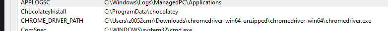
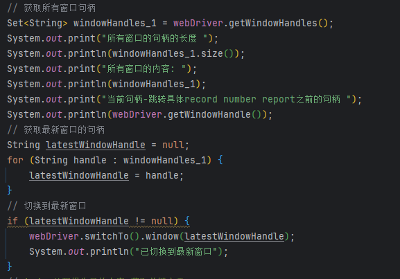

# 交接文档
这个软件是自动化流程的工具 从西门子内部网站上抓取页面元素 填入到excel表格中去 **项目代码里的代码注释以及todo注释有误 请忽略** 详细注释请参考如下注释

## 开发环境
- Java使用了11版本
  - openjdk version "11.0.26" 2025-01-21 LTS
  - OpenJDK Runtime Environment Corretto-11.0.26.4.1 (build 11.0.26+4-LTS)
  - OpenJDK 64-Bit Server VM Corretto-11.0.26.4.1 (build 11.0.26+4-LTS, mixed mode)
- Selenium，一个常见的自动化框架。 需要的驱动文件已安装在LuMengJia的AutoSoftware路径下 驱动版本需要和谷歌浏览器版本兼容 我的代码里访问Selenium 谷歌浏览器驱动使用了系统环境变量
- 
- Maven 3.9.8
- 未使用Git和数据库 组内无服务器和代码托管工具


## 开发思路
- 注意 代码里大量的用了如下刷新切换句柄的操作是为了刷新页面 因为页面上点击以后页面元素会变化 刷新一下句柄后续就能获取到对应的元素了
- 
- 爬虫的常见操作就是 点击元素 等待一段时间 切换iframe以定位到相应的元素
- 获取元素通过xpath xpath可以通过网页 右键inspect 选取元素 右键 copy full xpath来取得
- 带有注释的代码解释如下 automateAndDownloadFile函数控制页面跳转流程 clickViewReportAndExtractField函数爬取目标页面的元素
```java
@Service
public class SmartSolveAutomationService {
    @Autowired
    private WebDriver webDriver; // 配置类 谷歌浏览器驱动
    @Autowired
    private AppConfig appConfig; // 网页上配置路径的类 读取文件里的路径传入该服务中
    // 在 SmartSolveAutomationService 类中添加一个成员变量来存储窗口句柄
    private List<String> windowHandlesList = new ArrayList<>(); // 记录浏览器中每个页面的句柄 每个页面都有一个句柄 维护一个list切换或者移除页面
    private int count = 0; //计数处理好的报告数量
    private List<List<String>> textsNeedtoBeInserted = new ArrayList<>(); // 存放要插入模版中的新纪录 是一个N*37的大小
    private List<List<String>> log = new ArrayList<>(); // 用于在页面上显示今日处理了的报告 报告号+网页link

    public void automateAndDownloadFile() {
        Instant start = Instant.now(); // 记录开始时间
        // 测试 读取NMPA来的template文件
        List<List<String>> data_template = readExcelFile(appConfig.getTemplateFilePath());
        System.out.println(data_template.size());
        System.out.println(data_template.get(0).size());

        System.out.println("测试 路径配置");
        System.out.println(appConfig.getTemplateFilePath());
        System.out.println(appConfig.getLogFilePath());
        System.out.println("测试 路径配置结束");

        // 导航到网站
        webDriver.get("https://siemens.pilgrimasp.com/prod/smartsolve/Pages/Dashboard.aspx#/load?tabId=Home&searchPage=%7B-au-%7DPages/SmartPortal.aspx");
        // 等待1.5分钟 来让用户登录！ 测试发现 有时需要登录 有时不需要登录
        try {
            Thread.sleep(90000);
        } catch (InterruptedException e) {
            e.printStackTrace();
        }
        System.out.println("user should login and load the home page!");

        // 跳转到RRU dashboard对应的界面
        webDriver.get("https://siemens.pilgrimasp.com/prod/smartsolve/Pages/Dashboard.aspx#/load?tabId=Home&searchPage=%7B-au-%7DPages/SmartPortal.aspx%7B-qm-%7DItmId%7B-eq-%7D0000000000000002147484680");
        try {
            Thread.sleep(15000);
        } catch (InterruptedException e) {
            e.printStackTrace();
        }
        System.out.println("load the RRU Dashboard page!");

        // 切换到第一层iframe
        WebDriverWait wait = new WebDriverWait(webDriver, Duration.ofSeconds(15));
        WebElement iframe = wait.until(ExpectedConditions.presenceOfElementLocated(By.id("search-pane-content-iframe")));
        webDriver.switchTo().frame(iframe);
        System.out.println("Switch to another frame!");

        // 切换到第二层iframe
        String secondIframeId = "wpManager_wp202144868_wp790622277_iframe1";
        WebElement secondIframe = wait.until(ExpectedConditions.presenceOfElementLocated(By.id(secondIframeId)));
        webDriver.switchTo().frame(secondIframe);
        System.out.println("Switch to the second frame!");

        try {
            Thread.sleep(10000);
        } catch (InterruptedException e) {
            e.printStackTrace();
        }

        // 记录当前的窗口句柄
        windowHandlesList.add(webDriver.getWindowHandle());

        //读取已处理numbers文件的log
        //String logFilePath = "C:\\Users\\z0052cmr\\IdeaProjects\\OverseasAutomationTool\\src\\main\\resources\\SiemensLog_Report_Number.csv";
        List<String> complaintNumbers = readCSVFile(appConfig.getLogFilePath());


        // 获取页码相关的信息 总共有多少条目和总页数
        WebElement totalPages = webDriver.findElement(By.xpath("/html/body/form/div[4]/div[6]/table/tbody/tr/td/div/table[2]/tbody/tr[1]/td/div[2]/table/tfoot/tr/td/table/tbody/tr/td/div[5]/strong[2]/span"));
        WebElement totalItems = webDriver.findElement(By.xpath("/html/body/form/div[4]/div[6]/table/tbody/tr/td/div/table[2]/tbody/tr[1]/td/div[2]/table/tfoot/tr/td/table/tbody/tr/td/div[5]/strong[5]/span"));

        int totalPagesCount = Integer.parseInt(totalPages.getText());
        int totalItemsCount = Integer.parseInt(totalItems.getText());

        System.out.println("Total Pages: " + totalPagesCount);
        System.out.println("Total Items: " + totalItemsCount);
        // 需要点击i次来实现换页
        for (int i = 1; i <= totalPagesCount; i++) {
            System.out.println("当前页码");
            System.out.println(i);
            // 处理当前页面的元素 根据tbody获取所有的行
            // 找到表格的 tbody 的元素
            WebElement tbody = webDriver.findElement(By.xpath("/html/body/form/div[4]/div[6]/table/tbody/tr/td/div/table[2]/tbody/tr[1]/td/div[2]/table/tbody"));
            // 获取 div_resultGrid 下的所有 tr 元素 每个tr元素都是一个row
            List<WebElement> rows = tbody.findElements(By.tagName("tr"));

            for (WebElement row : rows) {
                // 找到每行的第二个 td 元素（假设投诉编号在第二个 td 中）
                System.out.println("查看每一个行row的信息的所有单元格cells的信息 ");
                try {
                    Thread.sleep(5000);
                } catch (InterruptedException e) {
                    e.printStackTrace();
                }
                List<WebElement> cells = row.findElements(By.tagName("td"));

                for (WebElement cell : cells) {
                    System.out.print(cell.getText()+ "\t");
                }
                System.out.println();
                if (cells.size() > 1) {
                    // record number 字段
                    WebElement cell_record_number = cells.get(1);
                    String cellText_record_number = cell_record_number.getText().trim();
                    // group 字段
                    WebElement cell_group = cells.get(4);
                    String cellText_group = cell_group.getText().trim();
                    // 获取region字段
                    WebElement cell_region = cells.get(5);
                    String cellText_region= cell_region.getText().trim();
                    System.out.println("开始判断是不是CN_DX, 非CHINA地区 且非followup 字段");
                    if (cellText_record_number != null && cellText_record_number.length() > 0
                            && cellText_group != null && cellText_group.length() > 0 && cellText_group.contains("CN_DX")
                            && cellText_region != null && cellText_region.length() > 0 && !"CHINA".equals(cellText_region)) {

                        System.out.print(cellText_record_number);
                        System.out.print(" ");
                        System.out.println(cellText_group);

                        // 已经初步找到合适的数据RRU_CN_DX Group User的record number 接下来查询出在西门子log中不存在的新数据
                        if(complaintNumbers.contains(cellText_record_number)) {
                            System.out.println("Complaint: " + cellText_record_number + " existed!");

                        }else{
                            //不存在的数据
                            System.out.println("Complaint: " + cellText_record_number + " is new record number!");
                            //获取到新record number对应的网页链接
                            WebElement link = cells.get(0).findElement(By.cssSelector("div span a"));
                            link.click();
                            try {
                                Thread.sleep(40000); // 等待40秒，实际使用中建议使用 WebDriverWait 这个报告的页面反应非常慢
                            } catch (InterruptedException e) {
                                e.printStackTrace();
                            }
                            // 获取所有窗口句柄
                            Set<String> windowHandles_1 = webDriver.getWindowHandles();
                            System.out.print("所有窗口的句柄的长度 ");
                            System.out.println(windowHandles_1.size());
                            System.out.print("所有窗口的内容: ");
                            System.out.println(windowHandles_1);
                            System.out.print("当前句柄-跳转具体record number report之前的句柄 ");
                            System.out.println(webDriver.getWindowHandle());
                            // 获取最新窗口的句柄
                            String latestWindowHandle = null;
                            for (String handle : windowHandles_1) {
                                latestWindowHandle = handle;
                            }
                            // 切换到最新窗口
                            if (latestWindowHandle != null) {
                                webDriver.switchTo().window(latestWindowHandle);
                                System.out.println("已切换到最新窗口");
                            }
                            // 处理报告里的内容 获取关键字段
                            //切换到对应的iframe
                            WebDriverWait wait_content = new WebDriverWait(webDriver, Duration.ofSeconds(15));
                            WebElement iframe_content = wait_content.until(ExpectedConditions.presenceOfElementLocated(By.id("record-pane-content-iframe")));
                            webDriver.switchTo().frame(iframe_content);
                            System.out.println("Switch to complaint content frame!");

                            //点击 details
                            WebElement detailsButton = webDriver.findElement(By.xpath("/html/body/div/form/div[4]/div/div[10]/div[3]/div[2]/div/div/div/div[3]/div[1]/h3/div/a"));
                            JavascriptExecutor js_go = (JavascriptExecutor) webDriver;
                            js_go.executeScript("arguments[0].click();", detailsButton);
                            System.out.println("Clicked the details button!");
                            // 点击了details button以后等待5s
                            try {
                                Thread.sleep(5000);
                            } catch (InterruptedException e) {
                                e.printStackTrace();
                            }
                            //刷新窗口 因为我有了新的下拉窗口
                            // 获取所有窗口句柄
                            Set<String> windowHandles_2 = webDriver.getWindowHandles();
                            System.out.print("所有窗口的句柄的长度 ");
                            System.out.println(windowHandles_2.size());
                            System.out.print("所有窗口的句柄的内容 ");
                            System.out.println(windowHandles_2);
                            System.out.print("当前句柄-点击了details以后的句柄 ");
                            System.out.println(webDriver.getWindowHandle());
                            // 获取最新窗口的句柄
                            latestWindowHandle = null;
                            for (String handle : windowHandles_2) {
                                latestWindowHandle = handle;
                            }
                            // 切换到最新窗口
                            if (latestWindowHandle != null) {
                                webDriver.switchTo().window(latestWindowHandle);
                                System.out.println("已切换到最新窗口");
                            }

                            WebDriverWait wait_toggle = new WebDriverWait(webDriver, Duration.ofSeconds(15));
                            WebElement iframe_toggle = wait_toggle.until(ExpectedConditions.presenceOfElementLocated(By.id("record-pane-content-iframe")));
                            webDriver.switchTo().frame(iframe_toggle);
                            System.out.println("Switch to complaint toggle frame!");

                            //点击 regulartory  reports toggle paneal
                            WebElement reportButton = webDriver.findElement(By.xpath("/html/body/div/form/div[4]/div/div[10]/div[3]/div[2]/div/div/div/div[3]/div[1]/div/div[28]/div/h3/span"));
                            JavascriptExecutor js_report = (JavascriptExecutor) webDriver;
                            js_report.executeScript("arguments[0].click();", reportButton);
                            System.out.println("Clicked the regulatory report toggle panel button!");

                            //刷新窗口 因为我有了新的下拉窗口
                            // 获取所有窗口句柄
                            Set<String> windowHandles_3 = webDriver.getWindowHandles();
                            System.out.println("所有窗口的句柄的长度");
                            System.out.println(windowHandles_3.size());
                            System.out.println(windowHandles_3);
                            System.out.println("当前句柄-点击了details以后的句柄");
                            System.out.println(webDriver.getWindowHandle());
                            // 获取最新窗口的句柄
                            latestWindowHandle = null;
                            for (String handle : windowHandles_3) {
                                latestWindowHandle = handle;
                            }
                            // 切换到最新窗口
                            if (latestWindowHandle != null) {
                                webDriver.switchTo().window(latestWindowHandle);
                                System.out.println("已切换到最新窗口");
                            }

                            WebDriverWait wait_fda = new WebDriverWait(webDriver, Duration.ofSeconds(15));
                            WebElement iframe_fda = wait_fda.until(ExpectedConditions.presenceOfElementLocated(By.id("record-pane-content-iframe")));
                            webDriver.switchTo().frame(iframe_fda);
                            System.out.println("Switch to complaint regularoty report frame!");

                            String pageSource = webDriver.getPageSource();
                            // 保存 HTML 内容到文件 debug用的
//                            try (FileWriter writer = new FileWriter("complaint_content_regulatory_report.html")) {
//                                writer.write(pageSource);
//                                System.out.println("HTML 内容已保存到 complaint_content_regulatory_report.html 文件中。");
//                            } catch (IOException e) {
//                                throw new RuntimeException(e);
//                            }

                            //点击 fda 对应的tbody的元素 看看能不能获取到
                            WebElement reports_tbody = webDriver.findElement(By.xpath("/html/body/div/form/div[4]/div/div[10]/div[3]/div[2]/div/div/div/div[3]/div[1]/div/div[28]/div/div/div[2]/div/div/div[1]/div[2]/div/table/tbody"));
                            System.out.println("FDA Button 找到了 ");
                            List<WebElement> rows_reports = reports_tbody.findElements(By.tagName("tr"));

                            // 从第二个 tr 标签开始遍历（索引为 1）
                            for (int j = 1; j < rows_reports.size(); j++) {
                                WebElement row_r = rows_reports.get(j);
                                // 获取当前 tr 下的所有 td 元素
                                List<WebElement> cells_r = row_r.findElements(By.tagName("td"));

                                String regulatoryBody = null;
                                String status = null;
                                String followUpNumber = null;

                                if (cells_r.size() > 1) {
                                    // 获取第二个 td 元素
                                    WebElement secondTd = cells_r.get(1);
                                    status = cells_r.get(10).getText();
                                    followUpNumber = cells_r.get(11).getText();
                                    try {
                                        // 定位第二个 td 中的超链接元素
                                        Thread.sleep(15000);
                                        WebElement link_fda = secondTd.findElement(By.cssSelector("div.control-container a.pHyperLink"));
                                        regulatoryBody = link_fda.getText();
                                        System.out.println(regulatoryBody + " " + status + " follow up number: " + followUpNumber);
                                        if (regulatoryBody.contains("FDA") && status.equals("CLOSED") && followUpNumber.isEmpty()) {
                                            //link_fda.click();
                                            JavascriptExecutor js_fda_click = (JavascriptExecutor) webDriver;
                                            js_fda_click.executeScript("arguments[0].click();", link_fda);
                                            System.out.println("Clicked FDA button!");
                                            // 处理新页面的逻辑，例如获取页面标题
                                            System.out.println("进入FDA报告的新页面: " + webDriver.getTitle());
                                            Thread.sleep(10000);
                                            count++;
                                            List<String> currentRow = new ArrayList<>();
                                            List<String> currentRowLog = new ArrayList<>();
                                            clickViewReportAndExtractField(currentRow, cellText_record_number, currentRowLog);
                                            // 找到当前的fda close 不是followup的唯一报告了 直接退出循环 break 不要删除
                                            break;
                                        }
                                    } catch (Exception e) {
                                        System.out.println("未找到超链接或点击失败: " + e.getMessage());
                                    }
                                }
                            }
                            System.out.println("所有的regulatory reports遍历完毕 接下来应该关闭当前窗口 回到dashboard界面");
                            boolean alertFound = false;
                            int backCount = 0;
                            while (!alertFound) {
                                try {
                                    // 点击 back 操作
                                    webDriver.navigate().back();
                                    backCount++;
                                    System.out.println("点击了 back " + backCount + " 次");
                                    // 等待警告框出现
                                    WebDriverWait wait_alert = new WebDriverWait(webDriver, Duration.ofSeconds(5));
                                    wait_alert.until(ExpectedConditions.alertIsPresent());
                                    // 获取警告框
                                    org.openqa.selenium.Alert alert = webDriver.switchTo().alert();
                                    // 获取警告框的文本信息
                                    String alertText = alert.getText();
                                    System.out.println("Alert text: " + alertText);
                                    // 接受警告框（点击确定）
                                    alert.accept();
                                    alertFound = true;
                                    Thread.sleep(5000);
                                    // 刷新页面 然后重新定位到 iframe 去
                                    Set<String> windowHandles_back_to_dash = webDriver.getWindowHandles();
                                    System.out.print("所有窗口的句柄的长度 ");
                                    System.out.println(windowHandles_back_to_dash.size());
                                    System.out.print("所有窗口的句柄的内容 ");
                                    System.out.println(windowHandles_back_to_dash);
                                    System.out.print("当前句柄为了遍历下一个行 row 刷新页面 ");
                                    System.out.println(webDriver.getWindowHandle());
                                    // 获取最新窗口的句柄
                                    String latestWindowHandle_back_to_dash = null;
                                    for (String handle : windowHandles_back_to_dash) {
                                        latestWindowHandle_back_to_dash = handle;
                                    }
                                    // 切换到最新窗口
                                    if (latestWindowHandle_back_to_dash != null) {
                                        webDriver.switchTo().window(latestWindowHandle_back_to_dash);
                                        System.out.println("为了遍历下一行刷新窗口");
                                    }
                                    Thread.sleep(10000);
                                    // 切换到第一层 iframe
                                    WebDriverWait wait_back_to_dash_1 = new WebDriverWait(webDriver, Duration.ofSeconds(15));
                                    WebElement iframe_11 = wait_back_to_dash_1.until(ExpectedConditions.presenceOfElementLocated(By.id("search-pane-content-iframe")));
                                    webDriver.switchTo().frame(iframe_11);
                                    System.out.println("back to dash - Switch to another frame!");
                                    // 切换到第二层 iframe
                                    String secondIframeId_back_to_dash_1 = "wpManager_wp202144868_wp790622277_iframe1";
                                    WebElement secondIframe_22 = wait.until(ExpectedConditions.presenceOfElementLocated(By.id(secondIframeId_back_to_dash_1)));
                                    webDriver.switchTo().frame(secondIframe_22);
                                    System.out.println("back to dash - Switch to the second frame!");
                                    Thread.sleep(5000);
                                } catch (org.openqa.selenium.NoAlertPresentException e) {
                                    // 如果没有警告框弹出，继续循环
                                    System.out.println("No alert present. 继续点击 back...");
                                } catch (InterruptedException e) {
                                    e.printStackTrace();
                                } catch (Exception e) {
                                    e.printStackTrace();
                                }
                            }
                        }
                    }
                    else{
                        System.out.println("不满足条件 不进行后续判断");
                    }
                }
            }
            System.out.println("dashboard中当前分页已经处理完毕 点击next page button进入下一页");

            // 获取next page button
            WebElement nextPageButton = webDriver.findElement(By.xpath("/html/body/form/div[4]/div[6]/table/tbody/tr/td/div/table[2]/tbody/tr[1]/td/div[2]/table/tfoot/tr/td/table/tbody/tr/td/div[3]/input[1]"));

            try {
                Thread.sleep(5000); // 等待5秒
            } catch (InterruptedException e) {
                e.printStackTrace();
            }
            if (i < totalPagesCount) {
                JavascriptExecutor js = (JavascriptExecutor) webDriver;
                js.executeScript("arguments[0].click();", nextPageButton);
                System.out.println("Clicked the next page button!");
                // 点击了next page button以后等待10s
                try {
                    Thread.sleep(8000);
                } catch (InterruptedException e) {
                    e.printStackTrace();
                }
            }
        }
        Instant end = Instant.now(); // 记录结束时间
        System.out.print("已经处理的报告数: ");
        System.out.println(count);
        long duration = Duration.between(start, end).toMinutes(); // 计算耗时（单位：分钟）
        System.out.println("当前方法耗时: " + duration + " 分钟");
        insertNewRowsToTemplate();
        backUpOutputs();
        writeCurrentDayRecordNumberIntoLog(appConfig.getLogFilePath());

        System.out.println("End!");
    }

    public void clickViewReportAndExtractField(List<String> currentRow, String cellText_record_number, List<String> currentRowLog){
        // 需要切换一下窗口句柄 因为新增了一个窗口
        // 获取所有窗口句柄
        System.out.println("进入到clickViewReportAndExtractField函数");
        Set<String> windowHandles_1 = webDriver.getWindowHandles();
        System.out.print("所有窗口的句柄的长度 ");
        System.out.println(windowHandles_1.size());
        System.out.print("所有窗口的句柄的内容 ");
        System.out.println(windowHandles_1);
        // 获取最新窗口的句柄
        String latestWindowHandle = null;
        for (String handle : windowHandles_1) {
            latestWindowHandle = handle;
        }
        // 切换到最新窗口
        if (latestWindowHandle != null) {
            webDriver.switchTo().window(latestWindowHandle);
            System.out.print("已切换到最新窗口 当前为 ");
            System.out.println(webDriver.getWindowHandle());
            windowHandlesList.add(webDriver.getWindowHandle());
        }

//        String pageSource = webDriver.getPageSource();
//        // 保存 HTML 内容到文件
//        try (FileWriter writer = new FileWriter("page_before_click_view_report.html")) {
//            writer.write(pageSource);
//            System.out.println("HTML 内容已保存到 page_before_click_view_report.html 文件中。");
//        } catch (IOException e) {
//            throw new RuntimeException(e);
//        }

        // /html/body/div/form/div[4]/div/div[10]/div[3]/div[2]/div/div/div/div[1]/div/div/div[3]/ul/li[4]/span

        //点击 details
        WebElement detailsButton = webDriver.findElement(By.xpath("/html/body/div/form/div[4]/div/div[10]/div[3]/div[2]/div/div/div/div[1]/div/div/div[3]/ul/li[4]/span"));
        JavascriptExecutor js_go = (JavascriptExecutor) webDriver;
        js_go.executeScript("arguments[0].click();", detailsButton);
        System.out.println("Clicked the details button in new webpage");

        Set<String> windowHandles_2 = webDriver.getWindowHandles();
        System.out.print("所有窗口的句柄的长度 ");
        System.out.println(windowHandles_2.size());
        System.out.print("所有窗口的句柄的内容 ");
        System.out.println(windowHandles_2);
        // 获取最新窗口的句柄
        latestWindowHandle = null;
        for (String handle : windowHandles_2) {
            latestWindowHandle = handle;
        }
        // 切换到最新窗口
        if (latestWindowHandle != null) {
            webDriver.switchTo().window(latestWindowHandle);
            System.out.print("已切换到最新窗口 当前窗口为 ");
            System.out.println(webDriver.getWindowHandle());
        }

        try {
            Thread.sleep(4000);
        } catch (InterruptedException e) {
            e.printStackTrace();
        }

        //点击 view report
        // /html/body/div/form/div[4]/div/div[10]/div[3]/div[2]/div/div/div/div[3]/div[1]/div/div[2]/div/div[1]/div/div[1]/div/ul/li[2]/div[2]/a
        WebElement vieweportButton = webDriver.findElement(By.xpath("/html/body/div/form/div[4]/div/div[10]/div[3]/div[2]/div/div/div/div[3]/div[1]/div/div[2]/div/div[1]/div/div[1]/div/ul/li[2]/div[2]/a"));
        JavascriptExecutor js_view = (JavascriptExecutor) webDriver;
        js_view.executeScript("arguments[0].click();", vieweportButton);
        System.out.println("Clicked the view report button in new webpage");

        try {
            Thread.sleep(10000);
        } catch (InterruptedException e) {
            e.printStackTrace();
        }
        System.out.println("进入view report界面");

        // 刷新 开始获取view report界面里的字段
        // 获取所有窗口句柄
        Set<String> windowHandles_v = webDriver.getWindowHandles();
        System.out.print("所有窗口的句柄的长度 ");
        System.out.println(windowHandles_v.size());
        System.out.print("所有窗口的句柄的内容 ");
        System.out.println(windowHandles_v);
        // 获取最新窗口的句柄
        String latestWindowHandle_v = null;
        for (String handle : windowHandles_v) {
            latestWindowHandle_v = handle;
        }
        // 切换到最新窗口
        if (latestWindowHandle_v != null) {
            webDriver.switchTo().window(latestWindowHandle_v);
            System.out.print("已切换到最新窗口 当前窗口为");
            System.out.println(webDriver.getWindowHandle());
            windowHandlesList.add(webDriver.getWindowHandle());
        }
        System.out.println("开始提取字段");
        

        // 第一到五列 暂时填充为空字符串
        currentRow.add(""); //1 产品名称
        currentRow.add(""); //2 注册证编号
        currentRow.add(""); //3 产地
        currentRow.add(""); //4 管理类别
        currentRow.add(""); //5 产品类别

        //6 产品批号 D4 serial number or lot number 二者选一
        WebElement serialNumber = null;
        try {
            serialNumber = webDriver.findElement(By.xpath("/html/body/form/div[7]/div/div[2]/div/div[1]/div/div/div[9]/div/div/div/div/div[5]/fieldset/div[7]/div/ul/li[2]/div/label[2]"));
            System.out.print("SerialNumber ");
            System.out.println(serialNumber.getText());
        } catch (NoSuchElementException e) {
            System.out.println("未找到 serialNumber 元素");
        }

        WebElement lotNumber = null;
        try {
            lotNumber = webDriver.findElement(By.xpath("/html/body/form/div[7]/div/div[2]/div/div[1]/div/div/div[9]/div/div/div/div/div[5]/fieldset/div[2]/div/ul/li[2]/div"));
            System.out.print("LotNumber ");
            System.out.println(lotNumber.getText());
        } catch (NoSuchElementException e) {
            System.out.println("未找到 lotNumber 元素");
        }

        if (serialNumber.getText().isEmpty() || serialNumber.getText().equals("N/A")) {
            currentRow.add(lotNumber.getText());
        }else{
            currentRow.add(serialNumber.getText());
        }

        //产品编号 UDI 生产日期 注意生产日期就是不填
        //
        WebElement smn = null;
        try{
            smn = webDriver.findElement(By.xpath("/html/body/form/div[7]/div/div[2]/div/div[1]/div/div/div[9]/div/div/div/div/div[5]/fieldset/div[4]/div/ul/li[2]/div/label[2]"));
            System.out.print("Smn ");
            System.out.println(smn.getText());
            currentRow.add(smn.getText()); // 7
        }catch (NoSuchElementException e) {
            System.out.println("没找到 smn 也就是catalog number");
            currentRow.add(smn.getText());
        }
        currentRow.add(""); //8
        currentRow.add(""); //9

        // 如果是试剂的话 MDR上有有效期这个字段 仪器的话没有有效期这个字段 10

        WebElement expirationDate = null;
        try {
            expirationDate = webDriver.findElement(By.xpath("/html/body/form/div[7]/div/div[2]/div/div[1]/div/div/div[9]/div/div/div/div/div[5]/fieldset/div[5]/div/ul/li[2]/div"));
            System.out.print("ExpirationDate ");
            System.out.println(expirationDate.getText());
        } catch (NoSuchElementException e) {
            System.out.println("未找到 expirationDate 元素");
        }
        if (!expirationDate.getText().isEmpty()) {
            String newFormatDate = convertDate(expirationDate.getText());
            currentRow.add(newFormatDate);
        }else{
            currentRow.add("");
        }

        // 事件发生日期 11

        WebElement dateOfEvent = null;
        try {
            dateOfEvent = webDriver.findElement(By.xpath("/html/body/form/div[7]/div/div[2]/div/div[1]/div/div/div[5]/div/div/div/div/div[5]/fieldset/div[1]/div/ul/li[2]/div/label[2]"));
            System.out.print("dateOfEvent ");
            String stringDateOfEvent = dateOfEvent.getText();
            System.out.println(stringDateOfEvent);
            if (!stringDateOfEvent.isEmpty()) {
                String newFormatEventDate = convertDate(stringDateOfEvent);
                currentRow.add(newFormatEventDate);
            } else {
                currentRow.add("");
            }
        } catch (NoSuchElementException e) {
            System.out.println("未找到 dateOfEvent 元素");
            currentRow.add("");
        }

        // 发现或者悉知日期 这个字段来自于西门子log 暂时不填 12
        currentRow.add("");

        // 伤害 类型 一般选为 其他 13
        currentRow.add("其他");
        // 伤害表现 不填 14
        currentRow.add("");
        // 姓名不填 15
        currentRow.add("");

        //出生日期 其实一般情况都不填 16

        WebElement dateOfBirth = null;
        try {
            dateOfBirth = webDriver.findElement(By.xpath("/html/body/form/div[7]/div/div[2]/div/div[1]/div/div/div[3]/div/div/div/div/div[3]/fieldset/div[3]/div/ul/li[2]/div"));
            System.out.print("dateOfBirth ");
            System.out.println(dateOfBirth.getText());
            currentRow.add(dateOfBirth.getText());
        } catch (NoSuchElementException e) {
            System.out.println("未找到 dateOfBirth 元素");
            currentRow.add("");
        }


        //年龄 数字
        //   /html/body/form/div[7]/div/div[2]/div/div[1]/div/div/div[3]/div/div/div/div/div[3]/fieldset/div[1]/div/ul/li[2]

        //年龄 数字
        WebElement ageNumber = null;
        try {
            ageNumber = webDriver.findElement(By.xpath("/html/body/form/div[7]/div/div[2]/div/div[1]/div/div/div[3]/div/div/div/div/div[3]/fieldset/div[1]/div/ul/li[2]"));
            System.out.print("age字段 ");
            String ageNumberOriginalText = ageNumber.getText();
            System.out.println("age原字段");
            System.out.println(ageNumberOriginalText);
            String newAgeNumberString = ageNumberOriginalText.replaceAll("[\n\r]+", "-");
            System.out.println(newAgeNumberString);
            String[] parts = newAgeNumberString.split("-");
            String timeUnit = ""; //年龄单位 17
            String numberForAge = ""; //年龄数字 18
            if (parts.length > 1) {
                timeUnit = parts[1];
                numberForAge = parts[0];
            } else {
                timeUnit = "";
                numberForAge = "";
            }
            // 填充
            if (timeUnit.equals("Years")) {
                currentRow.add("岁");
            } else if (timeUnit.equals("Months")) {
                currentRow.add("月");
            } else if (timeUnit.equals("Days")) {
                currentRow.add("日");
            } else {
                currentRow.add("");
            }
            currentRow.add(numberForAge);
        } catch (NoSuchElementException e) {
            System.out.println("未找到 ageNumber 元素");
            currentRow.add("");
            currentRow.add("");
        }

        //sex

        WebElement sex = null;
        try {
            sex = webDriver.findElement(By.xpath("/html/body/form/div[7]/div/div[2]/div/div[1]/div/div/div[3]/div/div/div/div/div[5]/fieldset/div[1]/div/ul/li[2]/div"));
            System.out.print("sex ");
            String sexText = sex.getText();
            System.out.println(sexText);
            if (sexText.equals("Female")) {
                currentRow.add("女");
            } else if (sexText.equals("Male")) {
                currentRow.add("男");
            } else {
                currentRow.add("");
            }
        } catch (NoSuchElementException e) {
            System.out.println("未找到 sex 元素");
            currentRow.add("");
        }

        // 病历号
        currentRow.add(""); //20


        // 既往病史 21
        WebElement historyIllness = null;
        try {
            historyIllness = webDriver.findElement(By.xpath("/html/body/form/div[7]/div/div[2]/div/div[1]/div/div/div[5]/div/div/div/div/div[7]/fieldset/div[1]/div/ul/li[2]/div/div/div"));
            System.out.print("既往病史 ");
            String historyIllnessOriginalText = historyIllness.getText();
            String historyIllnessIranslateText = TranslationUtil.translate(historyIllnessOriginalText);
            Thread.sleep(1000);
            currentRow.add(historyIllnessIranslateText);
        } catch (NoSuchElementException e) {
            System.out.println("未找到 historyIllness 元素");
            currentRow.add("");
        } catch (InterruptedException e) {
            throw new RuntimeException(e);
        }

        // 故障表现 22
        WebElement bug = null;
        try {
            bug = webDriver.findElement(By.xpath("/html/body/form/div[7]/div/div[2]/div/div[1]/div/div/div[17]/div/div/div/div/div[7]/fieldset/div[1]/div/div[1]/div/div[1]/div[3]/div/table/tbody/tr[2]/td[4]/div[3]/label[2]"));
            System.out.println("故障表现 ");
            String bugOriginalText = cellText_record_number + "：" + bug.getText();
            System.out.println(bugOriginalText);
            currentRow.add(bugOriginalText);
        } catch (NoSuchElementException e) {
            System.out.println("未找到 故障表现 后半部分的 元素");
            currentRow.add("");
        }

        //预期治疗疾病或作用 23
        currentRow.add("");

        //器械使用日期 24
        if (dateOfEvent != null && !dateOfEvent.getText().isEmpty()) {
            String newFormatEventDate = convertDate(dateOfEvent.getText());
            currentRow.add(newFormatEventDate);
        } else {
            currentRow.add("");
        }

        //使用场所 25
        currentRow.add("医疗机构");

        // 场所名称 26
        // 医院名称
        WebElement facilityName = null;
        try {
            facilityName = webDriver.findElement(By.xpath("/html/body/form/div[7]/div/div[2]/div/div[1]/div/div/div[11]/div/div/div/div/div[1]/fieldset/div[9]/div/ul/li[2]/div/label[2]"));
            System.out.print("facilityName ");
            String stringfacilityName = facilityName.getText();
            System.out.println(stringfacilityName);
        } catch (NoSuchElementException e) {
            System.out.println("未找到 facilityName 元素");
        }

        // 国家
        WebElement countryName = null;
        try {
            countryName = webDriver.findElement(By.xpath("/html/body/form/div[7]/div/div[2]/div/div[1]/div/div/div[11]/div/div/div/div/div[1]/fieldset/div[21]/div/ul/li[2]/div/div/div/label[1]"));
            System.out.print("countryName ");
            String stringCountryName = countryName.getText();
            System.out.println(stringCountryName);
        } catch (NoSuchElementException e) {
            System.out.println("未找到 countryName 元素");
        }
        //合并
        if (facilityName != null && countryName != null) {
            currentRow.add(facilityName.getText() + ", " + countryName.getText());
        } else {
            currentRow.add("");
        }

        // 使用过程 27
        //  /html/body/form/div[7]/div/div[2]/div/div[1]/div/div/div[5]/div/div/div/div/div[5]/fieldset/div[4]/div/ul/li[2]/div/div/div
        WebElement description = webDriver.findElement(By.xpath("/html/body/form/div[7]/div/div[2]/div/div[1]/div/div/div[5]/div/div/div/div/div[5]/fieldset/div[4]/div/ul/li[2]/div/div/div"));
        System.out.print("使用过程 ");
        String originalText = description.getText();
        System.out.println(originalText);
        originalText = originalText.replaceAll("[\n\r]+", " ");

        WebElement B7 = webDriver.findElement(By.xpath("/html/body/form/div[7]/div/div[2]/div/div[1]/div/div/div[5]/div/div/div/div/div[5]/fieldset/div[6]/div/ul/li[2]/div/div/div"));
        System.out.print("B7 ");
        String B7OriginalText = B7.getText();
        B7OriginalText = B7OriginalText.replaceAll("[\n\r]+", " ");

        String translatedOriginalText = TranslationUtil2.translate(originalText);
        try {
            Thread.sleep(1000);
        } catch (InterruptedException e) {
            throw new RuntimeException(e);
        }
        String translatedB7OriginalText = TranslationUtil3.translate(B7OriginalText);
        try {
            Thread.sleep(1000);
        } catch (InterruptedException e) {
            throw new RuntimeException(e);
        }
        String finalTranslatedText = translatedOriginalText + '\n' + translatedB7OriginalText;
        System.out.println(finalTranslatedText);
        currentRow.add(finalTranslatedText);

        // 合并用药器械情况说明 28
        currentRow.add("");

        //是否展开了调查 29
        currentRow.add("是");

        //调查情况 30
        WebElement h8 = null;
        try {
            h8 = webDriver.findElement(By.xpath("/html/body/form/div[7]/div/div[2]/div/div[1]/div/div/div[17]/div/div/div/div/div[11]/fieldset/div[9]/div/ul/li[2]/div/div/div"));
            System.out.print("h8 ");
            String h8OriginalText = h8.getText();
            System.out.println(h8OriginalText);
            String h8OriginalText2 = h8OriginalText.replaceAll("[\n\r]+", " ");
            System.out.println("h8替换换行符");
            System.out.println(h8OriginalText2);
            String translatedH8OriginalText2 = TranslationUtil.translate(h8OriginalText2);
            currentRow.add(translatedH8OriginalText2);
        } catch (NoSuchElementException e) {
            System.out.println("未找到 h8 元素");
            currentRow.add("");
        }

        // 剩余七列
        currentRow.add(""); //31
        currentRow.add(""); //32
        currentRow.add(""); //33
        currentRow.add(""); //34
        currentRow.add(""); //35
        currentRow.add(""); //36
        currentRow.add(""); //37

        System.out.println("完成了一次row的add");
        System.out.print("currentRow list的长度为 " + currentRow.size());
        //将当前row 添加到原始的成员变量里去
        textsNeedtoBeInserted.add(currentRow);

        System.out.println("记录处理的log");
        String currentURl = webDriver.getCurrentUrl();
        currentRowLog.add(cellText_record_number);
        currentRowLog.add(currentURl);
        log.add(currentRowLog);

        //处理完当前MDR页面上的所有元素 关闭当前MD窗口
        webDriver.close();
        windowHandlesList.remove(windowHandlesList.size() - 1);
//        System.out.print("关闭了MDR界面以后的 当前所有句柄展示 ");
//        System.out.println(webDriver.getWindowHandles());
//        System.out.println("list 展示开始");
//        for (String handle : windowHandlesList) {
//            System.out.println(handle);
//        }
//        System.out.println("list 展示结束");
        System.out.print("手动切换了一下上一个窗口 查看当前窗口的handle ");
        webDriver.switchTo().window(windowHandlesList.get(windowHandlesList.size() - 1));
        System.out.println(webDriver.getWindowHandle());

        System.out.println("已经关闭了MDR页面");

        webDriver.close();
        windowHandlesList.remove(windowHandlesList.size() - 1);
//        System.out.print("关闭了FDA界面以后的 当前所有句柄展示 ");
//        System.out.println(webDriver.getWindowHandles());
//        System.out.println("list 展示开始");
//        for (String handle : windowHandlesList) {
//            System.out.println(handle);
//        }
//        System.out.println("list 展示结束");
        System.out.print("手动切换了一下上一个窗口也就是dashboard的界面 查看当前窗口的handle ");
        webDriver.switchTo().window(windowHandlesList.get(windowHandlesList.size() - 1));
        System.out.print("现在list的长度应该是1 ");
        System.out.println(windowHandlesList.size());
        System.out.println(webDriver.getWindowHandle());
    }

    public void backUpOutputs(){
        // 创建一个新的工作簿 作为备份文件
        Workbook workbook = new XSSFWorkbook();
        // 创建一个工作表
        Sheet sheet = workbook.createSheet("Sheet1");

        // 遍历二维列表，将每一行数据写入工作表
        for (int i = 0; i < textsNeedtoBeInserted.size(); i++) {
            List<String> rowList = textsNeedtoBeInserted.get(i);
            Row row = sheet.createRow(i); // 创建一行

            for (int j = 0; j < rowList.size(); j++) {
                String cellValue = rowList.get(j);
                Cell cell = row.createCell(j); // 创建一个单元格
                cell.setCellValue(cellValue); // 设置单元格的值
            }
        }
        // 将工作簿写入文件
        try (FileOutputStream fileOut = new FileOutputStream("output.xlsx")) {
            workbook.write(fileOut);
            System.out.println("Excel file backup created successfully!");
        } catch (IOException e) {
            e.printStackTrace();
        }
        // 关闭工作簿
        try {
            workbook.close();
        } catch (IOException e) {
            e.printStackTrace();
        }
    }

    public void insertNewRowsToTemplate() {
        String templatePath = appConfig.getTemplateFilePath();

        // 获取当前日期
        LocalDate currentDate = LocalDate.now();
        DateTimeFormatter dateFormatter = DateTimeFormatter.ofPattern("yyyyMMdd");
        String dateStr = currentDate.format(dateFormatter);

        // 获取当前时间戳
        long timestamp = System.currentTimeMillis();

        // 构建副本文件路径

        int lastDotIndex = templatePath.lastIndexOf('.');
        String fileNamePrefix = templatePath.substring(0, lastDotIndex);
        String fileExtension = templatePath.substring(lastDotIndex);
        String copyPath = fileNamePrefix + "_" + dateStr + "_" + timestamp + fileExtension;

        try {
            // 创建副本文件
            try (InputStream in = new FileInputStream(templatePath);
                 OutputStream out = new FileOutputStream(copyPath)) {
                byte[] buffer = new byte[1024];
                int length;
                while ((length = in.read(buffer)) > 0) {
                    out.write(buffer, 0, length);
                }
            }

            // 打开副本文件并写入数据
            try (FileInputStream fis = new FileInputStream(copyPath);
                 Workbook workbook = new XSSFWorkbook(fis)) {
                Sheet sheet = workbook.getSheetAt(0); // 获取第一个工作表

                // 从第三行开始写入数据
                int startRow = 2;
                for (int i = 0; i < textsNeedtoBeInserted.size(); i++) {
                    List<String> rowList = textsNeedtoBeInserted.get(i);
                    Row row = sheet.createRow(startRow + i);

                    for (int j = 0; j < rowList.size(); j++) {
                        String cellValue = rowList.get(j);
                        Cell cell = row.createCell(j);
                        cell.setCellValue(cellValue);
                    }
                }
                // 将修改后的工作簿写入文件
                try (FileOutputStream fileOut = new FileOutputStream(copyPath)) {
                    workbook.write(fileOut);
                }
            }
            System.out.println("Data written to the copy file successfully!");
        } catch (IOException e) {
            e.printStackTrace();
        }

    }

    public static String convertDate(String inputDate) {
        if (inputDate == null) {
            return null;
        }
        // 定义输入日期的格式
        DateTimeFormatter inputFormatter = DateTimeFormatter.ofPattern("dd-MMM-yyyy", Locale.ENGLISH);
        // 定义输出日期的格式
        DateTimeFormatter outputFormatter = DateTimeFormatter.ofPattern("yyyy-MM-dd");

        try {
            // 解析输入的日期字符串为 LocalDate 对象
            LocalDate date = LocalDate.parse(inputDate, inputFormatter);
            // 将 LocalDate 对象按照输出格式转换为字符串
            return date.format(outputFormatter);
        } catch (Exception e) {
            // 若解析失败，打印异常信息并返回 null
            e.printStackTrace();
            return inputDate;
        }
    }

    public void writeCurrentDayRecordNumberIntoLog(String csvFilePath){
        try (FileWriter writer = new FileWriter(csvFilePath, true)) {
            // 遍历 log 列表
            for (List<String> innerList : log) {
                if (!innerList.isEmpty()) {
                    // 获取内层列表的第一个字符串
                    String recordNumber = innerList.get(0);
                    // 追加到 CSV 文件中，并换行
                    writer.append(recordNumber).append("\n");
                }
            }
            System.out.println("Data appended to CSV file successfully.");
        } catch (IOException e) {
            System.err.println("Error appending data to CSV file: " + e.getMessage());
        }
    }

    public List<List<String>> getLog() {
        return log;
    }
}
```


# OverseasAutomationTool

